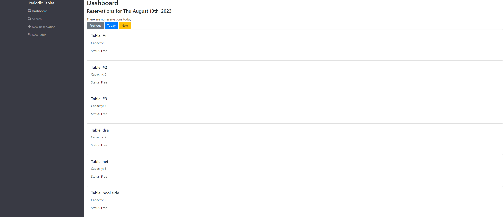
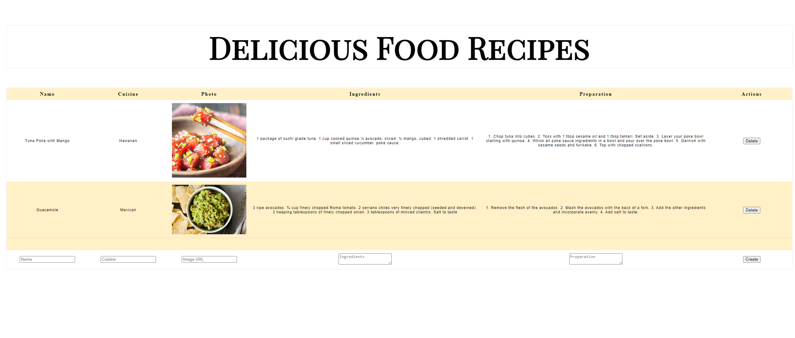

Welcome to my portfolio repository! This repository showcases a collection of my projects, achievements, and skills. Feel free to explore the various folders and files to learn more about my work and expertise.

# **_About Me_**

I am a passionate and dedicated engineer, and I have a strong background in front and back developlment. With a keen interest in optimization, I constantly strive to learn and create innovative solutions to real-world problems. This portfolio repository serves as a testament to my journey and growth in the field.

# **_Projects_**

_Reservations_

Description: Reservation application for restaurants to book, seat & finish reservations.

Technologies Used: React, postgreSQL, Express, Node.js

_Recipes Tracker_

Description: Recipe tracker to allow user to create recipes & upload an image of the recipe into a list.

Technologies Used: React, JS, CSS, HTML5

# **_Skills & Technologies_**

- Javascript
- Next.js
- React
- Node.js
- postreSQL
- HTML5
- CSS
- Tailwind.css
- Jest
- Mocha
- Chai

# **_Contact_**

I'm always open to new opportunities and collaborations. Feel free to reach out to me via email at brittain.hoover@gmail.com. You can also connect with me on [LinkedIn](https://www.linkedin.com/in/steven-britt-hoover/) or check out my personal [website](https://britthoover.netlify.app/).

Thank you for visiting my portfolio repository! I look forward to connecting with you.
